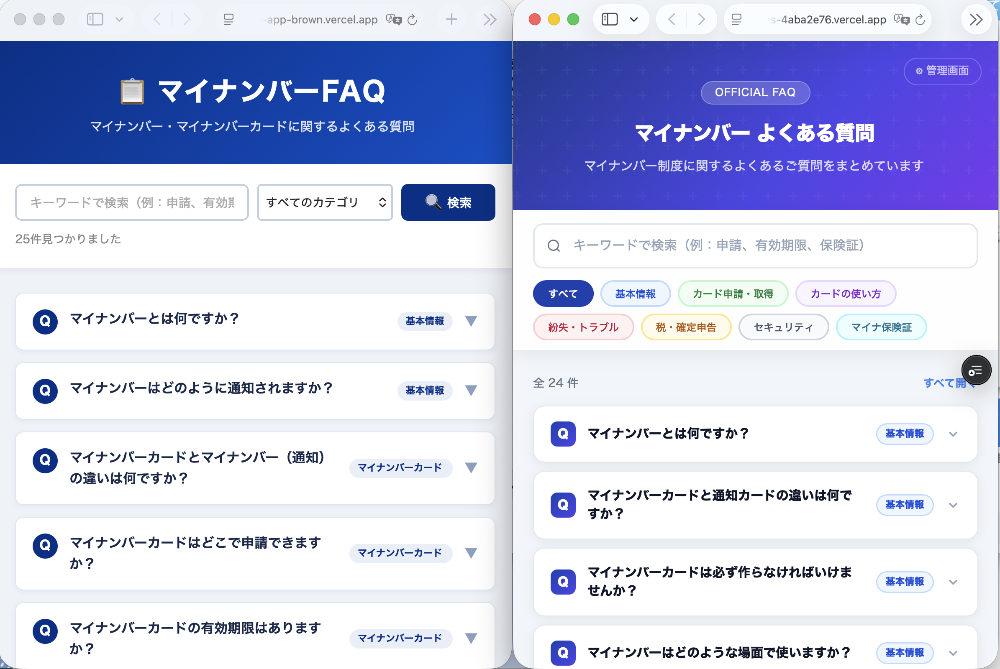

# Claude Codeではじめてのアプリ開発：FAQシステムを作ろう

## はじめに

このチュートリアルでは、プログラミング経験ゼロの方が、Claude Codeを使って「FAQシステム」を作ります。

> **エンジニアの方へ：** Claude Codeを初めて使う方でも物足りないと思いますが、最後に「[エンジニア向け：ここからさらに良くするには](#-エンジニア向けここからさらに良くするには)」というセクションを用意しています。

### なぜFAQシステム？

[コーディング未経験者8人とグループウェアを作ってみた〜ぼくらの七日間挑戦](https://note.interlink.blog/n/ncc90ca82c2e5)というエントリを書きましたが、実はすぐにグループウェア開発に取り掛かったわけではありません。

初日は、「シューティングゲームを作る」というミッションで、各人にやってもらいました。まずは動くものを作って成功体験を積んでもらって、やる気になってもらいたかったからです。

その経験を踏まえて、超初心者向けチュートリアルを作りました。内容は「FAQシステムを作る」です。

シューティングゲームだと会社で使えるわけではなく、発展性がありません。FAQシステムなら会社や部署のFAQを入れて、実務に利用することもできます。

### このチュートリアルで作るもの

FAQシステムとは、「よくある質問と回答」を検索・表示できるWebアプリです。以下のようなアプリが、約60分で完成します。



*左右はそれぞれ別の人がClaude Codeで作ったものです。同じ指示でも、デザインや機能が異なるのが面白いところです。*

**所要時間：** 約60分
**費用：** Claude Proの月額料金（$20/月）

> **⚠️ 注意：** Claude Codeを使うには、ClaudeのPro（$20/月）、Max（$100/月または$200/月）などの有料プランへの契約が必要です。無料プランでは利用できません。

---

## ステップ1：Claude Proに契約する

すでにPro・Maxなどの有料プランに契約済みの方は、このステップをスキップしてください。

1. ブラウザで [claude.ai](https://claude.ai) を開く
2. アカウントを作成する（メールアドレスで登録）
3. 画面の案内に従って「Pro」プランに申し込む（$20/月）
4. クレジットカード情報を入力して契約完了

> **💡 ポイント：** Claude Code を使うにはProプラン以上が必要です。

---

## ステップ2：ターミナルを開く

Claude Codeは「ターミナル」（黒い画面）で動きます。怖がらなくて大丈夫です。コマンドはすべてコピー＆ペーストするだけです。

### Windowsの場合

1. キーボードの `Windows` キーを押す
2. `PowerShell` と入力する
3. 「Windows PowerShell」が表示されるのでクリックして開く

### Macの場合

1. キーボードの `Command` + `Space` を押す
2. `ターミナル` と入力する
3. 「ターミナル」が表示されるので `Enter` を押して開く

---

## ステップ3：Node.jsをインストールする

Claude Codeを動かすために「Node.js」というソフトが必要です。以下のコマンドをターミナルにコピー＆ペーストして `Enter` を押してください。

### Windowsの場合

```powershell
winget install OpenJS.NodeJS.LTS
```

インストールが終わったら、**PowerShellを一度閉じて、もう一度開いてください**（ステップ2と同じ手順で）。

### Macの場合

まず、Homebrewというツールをインストールします。

```bash
/bin/bash -c "$(curl -fsSL https://raw.githubusercontent.com/Homebrew/install/HEAD/install.sh)"
```

途中でパスワードを聞かれたら、Macのログインパスワードを入力してください（入力しても画面に文字は表示されませんが、そのまま打って `Enter`）。

次に、Node.jsをインストールします。

```bash
brew install node
```

### 確認

以下のコマンドを実行して、バージョン番号（`v20.xx.x` のような数字）が表示されればOKです。

```
node -v
```

---

## ステップ4：Claude Codeをインストールする

以下のコマンドをコピー＆ペーストして `Enter` を押してください。Windows・Mac共通です。

```
npm install -g @anthropic-ai/claude-code
```

---

## ステップ5：作業フォルダを作って移動する

### Windowsの場合

```powershell
mkdir $HOME\faq-app
cd $HOME\faq-app
```

### Macの場合

```bash
mkdir ~/faq-app
cd ~/faq-app
```

---

## ステップ6：Claude Codeを起動する

以下のコマンドを実行します。

```
claude --dangerously-skip-permissions
```

初回はブラウザが開いて、ログイン画面が表示されます。claude.aiのアカウントでログインしてください。ログインが完了すると、ターミナルに戻ります。

`>` という入力欄が表示されたら準備完了です。

---

## ステップ7：FAQシステムを作る

ここからがメインです。以下の文章を **そのままコピー＆ペースト** して `Enter` を押してください。

```
検索できるFAQシステムを作って。FAQデータはマイナンバーのよくある質問を20件くらい作って。
```

たったこれだけです。Claude Codeが自動的に、技術の選択、ファイルの作成、必要なソフトのインストールをすべてやってくれます。

途中で「このコマンドを実行していいですか？」と聞かれたら `y` を入力して `Enter` を押してください。

**数分かかります。コーヒーでも淹れて待ちましょう。**

---

## ステップ8：アプリを起動して確認する

Claude Codeが完成すると、起動コマンドを教えてくれます。たとえば以下のようなコマンドです（Claude Codeが指示するものに従ってください）。

```
npm run dev
```

起動したら、ブラウザで以下のアドレスを開きます。

```
http://localhost:3000
```

**FAQシステムが表示されたら完成です！ おめでとうございます！ 🎉**

---

## ステップ9：もっと注文をつけてみよう

動くものができたら、Claude Codeにどんどん注文をつけてみましょう。日本語でOKです。たとえば：

- `カテゴリで絞り込めるようにして`
- `デザインをもっとおしゃれにして`
- `質問を追加して。マイナ保険証について5件`
- `「役に立った」ボタンをつけて`
- `管理画面を作って。質問の追加・編集・削除ができるようにして`

自分が使いやすいと思うものを、自分の言葉で伝える。それがClaude Codeでの開発です。

> **💡 次のステップ：** マイナンバーFAQの代わりに、あなたの会社の「よくある質問」を入れれば、そのまま業務で使えるFAQシステムになります。やり方は「[あなたの会社のFAQを作るには？](#あなたの会社のfaqを作るには)」で紹介しています。

---

## ステップ10：インターネットに公開する

ここまでのFAQシステムは、自分のパソコンの中だけで動いています。せっかく作ったので、インターネットに公開して、誰でもアクセスできるようにしてみましょう。

「Vercel（バーセル）」という無料のサービスを使います。

### 10-1：Vercelのアカウントを作る

1. ブラウザで [vercel.com](https://vercel.com) を開く
2. 「Sign Up」をクリック
3. 「Continue with Email」を選ぶ（GitHubアカウントは不要です）
4. メールアドレスを入力して登録する
5. 届いた確認メールのリンクをクリックして完了
6. プランの選択画面が表示されたら **「Hobby」（無料）** を選ぶ（「Pro」は有料なので選ばないでください）

### 10-2：公開する

Claude Codeがまだ起動している状態で、以下をコピー＆ペーストしてください。

```
このアプリをVercelにデプロイして。
```

Claude Codeが `npx vercel` コマンドを実行します。初回は以下のような質問が表示されるので、そのまま `Enter` を押していけばOKです。

- 「Set up and deploy?」→ `y` を入力
- 「Which scope?」→ そのまま `Enter`
- 「Link to existing project?」→ `n` を入力
- 「What's your project's name?」→ そのまま `Enter`
- 「In which directory is your code located?」→ そのまま `Enter`

しばらく待つと、こんなURLが表示されます。

```
https://faq-app-xxxxx.vercel.app
```

**このURLを誰かに送れば、あなたが作ったFAQシステムを見てもらえます！ 🌐**

> **💡 ポイント：** Vercelは無料で使えます。作ったアプリを消したくなったら、[vercel.com](https://vercel.com) の管理画面からいつでも削除できます。

---

## ステップ11：終了する

### Claude Codeを終了する

Claude Codeの入力欄で以下を入力します。

```
/exit
```

### アプリを停止する

ターミナルで `Ctrl` + `C` を押すと、アプリが停止します。

### 次回また起動するには

```
cd ~/faq-app
claude
```

とすれば、前回の続きから作業できます（Windowsの場合は `cd $HOME\faq-app`）。

---

## うまくいかないとき

| 症状 | 対処 |
|------|------|
| `node -v` でエラーが出る | ターミナルを閉じて開き直す。それでもダメならNode.jsのインストールをやり直す |
| `claude` コマンドが見つからない | ターミナルを閉じて開き直す。それでもダメなら `npm install -g @anthropic-ai/claude-code` をやり直す |
| ブラウザで何も表示されない | アドレスが `http://localhost:3000` になっているか確認。ポート番号が違う場合はClaude Codeの出力を確認 |
| Claude Codeが途中で止まった | `/exit` で一度終了して `claude` で再起動。「さっきの続きをやって」と入力 |
| 「コマンドを実行していいですか」が多くて面倒 | Claude Codeの質問には毎回 `y` で答えてOK（この練習では安全です） |

---

## 🔧 エンジニア向け：ここからさらに良くするには

上記のチュートリアルは「まず動くものを作る」ことに全振りしています。実務やポートフォリオとして発展させるなら、以下を検討してください。

### 技術選択を自分で行う

Claude Codeに任せると、おそらくNext.js + SQLite、またはシンプルなHTML + JSONあたりを選びます。目的に応じて自分で指定しましょう。

- **フロントだけで完結させたい場合：** React / Vue + 静的JSONファイル。DBなし。GitHub Pagesにデプロイ可能
- **検索を本格的にやりたい場合：** PostgreSQL + 全文検索（`pg_trgm`）、またはElasticsearch / Meilisearch
- **AIを組み込みたい場合：** FAQ回答にRAG（Retrieval-Augmented Generation）を導入。ベクトルDB（pgvector、Pinecone等）+ Embedding APIで類似質問検索

### CLAUDE.mdを活用する

プロジェクトルートに `CLAUDE.md` ファイルを置くと、Claude Codeがプロジェクトのルールや方針を毎回読み込みます。

```markdown
# CLAUDE.md

## 技術スタック
- Next.js 15 (App Router)
- TypeScript (strict mode)
- Tailwind CSS
- Prisma + PostgreSQL

## コーディング規約
- コンポーネントは関数コンポーネントのみ
- 日本語コメント必須
- テストは Vitest を使用
```

### FAQデータを外部ソースから取得する

練習ではClaude Codeに作ってもらいましたが、実際に使うなら：

- **オープンデータ：** 各自治体のオープンデータカタログからCSV/JSON形式で取得
- **スクレイピング：** デジタル庁やe-Govなどの公開FAQから取得（利用規約を確認のこと）
- **API：** FAQ管理SaaSのAPIから動的に取得

### デプロイする

ローカルで動くだけでは他の人に見せられません。

- **Vercel：** Next.jsなら `vercel` コマンド一発でデプロイ可能（無料枠あり）。無料のHobbyプランでも独自ドメインを設定できるので、社内向けFAQを `faq.example.com` のようなURLで公開することも可能
- **Cloudflare Pages：** 静的サイトなら無料で高速
- **Railway / Render：** DB付きのフルスタックアプリに対応

### 自動テストを追加する

Claude Codeに「テストを書いて」と指示すれば書いてくれます。ただし、テスト戦略は自分で設計しましょう。

```
以下のテストを追加して：
- FAQデータの検索ロジックのユニットテスト
- カテゴリフィルターの結合テスト
- 検索結果が0件の場合の表示テスト
```

### あなたの会社のFAQを作るには？

このチュートリアルではマイナンバーのFAQを題材にしましたが、同じ手順で自社のFAQシステムを作ることができます。ステップ7の指示を変えるだけです。

**方法1：その場でFAQを作ってもらう**

```
検索できるFAQシステムを作って。以下のFAQデータを使って。

Q: 有給休暇は何日前に申請すればいいですか？
A: 原則3営業日前までに申請してください。

Q: 経費精算の締め日はいつですか？
A: 毎月25日が締め日です。翌月10日に振り込まれます。

（...必要な分だけ追加...）
```

**方法2：既存のFAQドキュメントを読み込ませる**

社内のFAQがExcelやWordにまとまっている場合、そのファイルを作業フォルダに置いて：

```
faq-data.xlsx を読み込んで、検索できるFAQシステムを作って。
```

**方法3：まず作ってから差し替える**

チュートリアル通りにマイナンバーFAQで完成させた後、Claude Codeに指示します。

```
FAQデータを以下の内容に差し替えて。カテゴリも変更して。

カテゴリ：勤怠、経費、IT、総務

Q: パスワードを忘れました。どうすればいいですか？
A: 情報システム部にメールで連絡してください。当日中にリセットします。

（...）
```

いずれの方法でも、FAQの内容を入れ替えるだけで、検索やカテゴリ絞り込みの機能はそのまま使えます。

### Git管理をする

```
git init
git add .
git commit -m "initial: FAQ system"
```

Claude Codeは `git` と連携して動きます。ブランチを切って機能追加する練習にも最適です。
